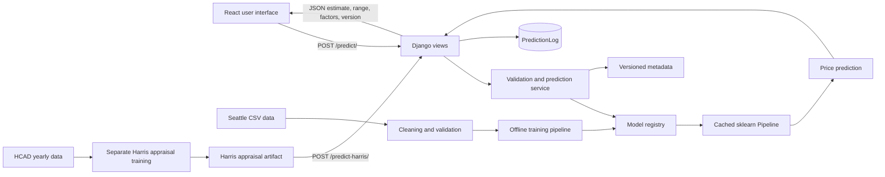

# Project Audit: AI-Powered Real Estate Valuation Platform

Audit updated: August 16, 2026

## Executive summary

The repository is a working full-stack ML prototype, not yet a production-ready valuation platform. The original Seattle Gradient Boosting model performed worse than a naive mean-style predictor (R² about -0.65). A later Phase 1 result claiming R² 0.9567 was invalid because `price_per_sqft` and `is_price_anomaly` were calculated from the target sale price and could not be reproduced by the API.

The active model is now version 3.0.0: a tuned HistGradientBoosting pipeline trained from the official King County real-property sales, residential-building, and parcel extracts. The privacy-safe preparation produces 83,593 validated Seattle-ZIP sales from 2015–July 2026, removes 17 exact duplicates, and excludes owner names, addresses, and recording identifiers at read time. The winning untuned rich model records five-fold parcel-grouped CV MAE $104,563, RMSE $214,331, and R² 0.832. After bounded tuning, the untouched 2025–2026 temporal holdout records MAE $149,333, RMSE $289,585, and R² 0.832.

The P0 rebuild is complete: validation, privacy-safe official-data joins, leakage-safe rich feature construction, complete baselines, grouped cross-validation, bounded tuning, temporal evaluation, and error analysis are reproducible. P1 adds a measured 90% temporal-residual interval, additive permutation-Shapley contributions, privacy-safe similar sales, backward-compatible rich API fields, and an upgraded UI. P2 adds checksummed artifacts, optional MLflow tracking, JSON logging, request/error/latency monitoring, request IDs, and feature-range signals. P3 adds hardened production settings, health probes, Docker Compose, scoped linting, GitHub Actions CI, and deployment documentation.

## Existing architecture

### Frontend

- React 18 application under `frontend/src/`.
- `pages/Houseprice.jsx` implements the Seattle five-field estimate workflow.
- `pages/About.jsx` consumes `/model-info/`.
- `pages/HarrisCounty.jsx` exposes the separately labeled HCAD appraisal prototype.
- The production client uses Vite 8 and the UI suite uses Vitest 4 with Testing Library. Lint, tests, and the production build pass without the former Create React App warnings.

### Django backend

- `backend/api/views.py` defines request/response endpoints.
- `backend/api/validation.py` owns structured request validation and normalized model fields.
- `backend/api/services.py` owns cached model loading, prediction, Harris inference, and optional Census/FRED context.
- `backend/api/models.py` stores privacy-minimal successful prediction logs.
- `backend/mlmodels/model_registry.json` selects the Seattle artifact.
- Ten backend tests currently pass.

### ML components

- `ml/data/prepare.py`: reproducible Seattle cleaning pipeline.
- `ml/data/validation.py`: reusable schema and domain validation.
- `ml/evaluation/eda.py`: reproducible EDA report and figures.
- `ml/training/benchmark.py`: current baseline and multi-model CV comparison.
- `ml/features/build_features.py`: inference-safe feature construction inside the pipeline.
- `ml/training/train_final.py`: active Seattle artifact training and registration.
- `ml/train_harris_county.py`: separate HCAD appraisal model.
- Superseded training code, notebooks, reports, and unregistered artifacts are isolated under
  `archive/` and have no active runtime references.

## Dataset inventory

| Dataset | Purpose | Rows | Target | Status |
|---|---|---:|---|---|
| Seattle raw train | Primary sale-price model | 2,016 | `price` | Active source |
| Seattle raw test | Legacy holdout | 505 | `price` | Already examined repeatedly |
| Ames/Kaggle | Historical sale-price experiments | 1,460 | `SalePrice` | Archived, not active |
| Harris 2024–2026 | County appraisal model | ~1.25M/year | `tot_mkt_val` | Separate secondary product |
| California Housing | Unrelated median-value dataset | 20,640 | `median_house_value` | Archived |
| Realtor country history | National market context | 121 months | None for property valuation | Archived |

The active product must not combine these targets or describe HCAD appraisals as verified sale prices.

## Seattle data findings

- Raw train: 2,016 rows, eight columns, nine exact duplicates.
- Cleaned train: 2,007 rows, six columns, no missing values or duplicates.
- Cleaned test: 504 rows.
- Raw missing lot information: 347 train rows and 77 test rows.
- Lot units include square feet and acres; cleaned values are standardized to square feet.
- Price range: $159,000 to $25,000,000.
- Raw target skew: 16.906; `log1p(price)` skew: 0.536.
- Conservative 3×IQR price outliers: 43.
- ZIP codes: 28 in training and 29 in test.
- No year built, renovation, coordinates, address, property ID, or named neighborhood is available.

Missing lot information is represented by zero and should be paired with a missingness indicator in candidate models. Luxury observations are retained because the source does not prove they are erroneous.

## Problems found

### Critical resolved during P0

1. Final selection is now nested-CV-driven; the legacy test is labeled and excluded from selection.
2. The unsafe Phase 1 deployment entry point is retired.
3. Target-derived ZIP tiers are excluded from the active pipeline.
4. The benchmark includes DummyRegressor and complete CV MAE/RMSE/R² results.

### High remaining

1. The target is extremely skewed and model stability changes materially by fold.
2. The small Seattle feature set limits location and condition signal; unrelated dataset
   narratives and duplicate artifacts are now isolated under `archive/`.
3. The only available Seattle fields limit achievable performance and comparable-property quality.

### Medium

1. Prediction, explanation, comparables, and external market context remain in one service
   module; further decomposition is optional and should follow measured maintenance needs.

### Low

1. The data-preparation CLI still uses human-readable console output rather than structured
   training logs.

## Current measured evidence

The historical Ridge comparison reproduces:

| Model | Test MAE | Test RMSE | Test R² |
|---|---:|---:|---:|
| Median DummyRegressor | $387,281 | $634,411 | -0.0871 |
| Previous Ridge | $242,731 | $408,547 | 0.5492 |

The selected tuned model records nested CV MAE $200,666 ± $38,069, RMSE $666,124 ± $483,074, and R² 0.495 ± 0.311. It improves CV MAE by 17.7% and CV RMSE by 4.0% relative to Ridge. Error analysis shows MAE $100,972 below $500K, $116,622 from $500K–$1M, $249,694 from $1M–$2M, and $1,194,129 above $2M.

## Testing and configuration

- Backend: 25 tests pass, including structured validation and SQLite/PostgreSQL configuration cases.
- ML validation/artifact tests: 18 tests pass.
- Frontend: three component tests and two browser end-to-end tests pass.
- Frontend production build: passes.
- Python runtime observed: 3.10.0.
- Key runtime versions: Django 5.2.16, NumPy 2.2.6, pandas 2.3.3, scikit-learn 1.4.2, joblib 1.5.3.
- Artifact runtime versions and dataset hashes are recorded; the project venv is required for compatibility.
- `.env.example`, optional MLflow integration, JSON logging, and monitoring now exist.
- Docker images and Compose were built and exercised end to end; production security checks pass.
- GitHub Actions, Ruff, ESLint, Playwright, health/readiness probes, and deployment documentation now exist.
- Six reviewed, reproducible desktop/mobile portfolio screenshots now document the real Compose application.
- The PostgreSQL 17 override, Psycopg runtime, CI service test, and guarded backup/restore workflow are validated.

## Remaining roadmap

1. Add verified sale outcomes for real-world error and calibration monitoring.
2. Add a configured deployment URL after a hosting target is selected.
3. Connect a licensed MLS/RESO source if verified live comparable sales are required.

All locally actionable implementation and cleanup milestones are complete. The items above
require new outcome data, an external hosting decision, or a licensed data provider.

