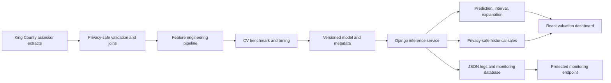
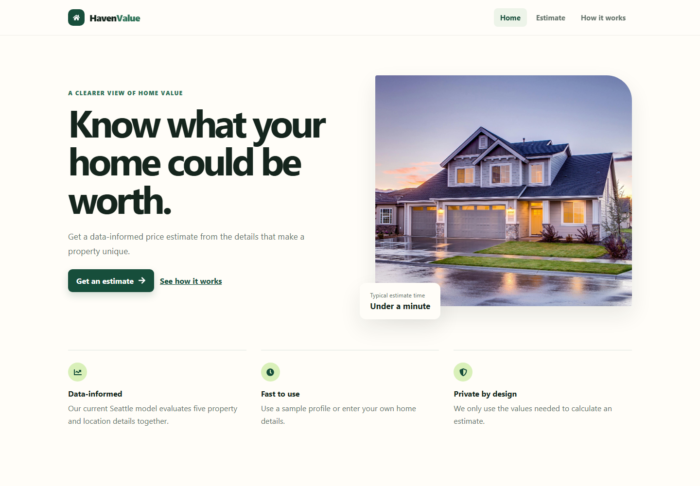
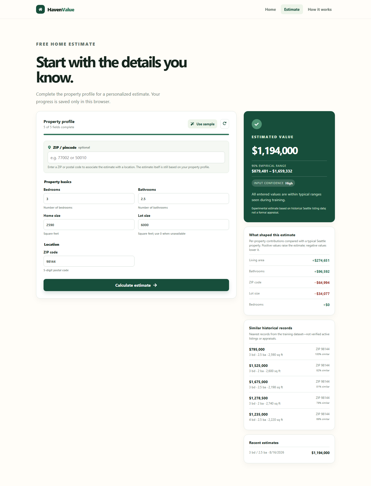

# House Price Prediction

A React interface backed by a Django API that estimates Seattle home prices. The active experimental model is a tuned HistGradientBoosting pipeline trained from official King County Assessor sale, residential-building, and parcel extracts.

**Current Model Performance:** five-fold parcel-grouped CV MAE $104,563, RMSE $214,331, and R² 0.832 for the untuned winning family. After bounded tuning, the untouched 2025–2026 temporal holdout records MAE $149,333, RMSE $289,585, and R² 0.832. See [`reports/MODEL_EVALUATION.md`](reports/MODEL_EVALUATION.md) for limitations and segment errors.

## Architecture



Training is an explicit offline command. Django loads the registered artifact once per worker;
it never trains a model during application startup or an API request.

## Project Status

- ✓ Phase 0 Complete: Data cleaned, baseline validated
- Phase 1 model rejected: target leakage found during production audit
- P0 model rebuild complete: CV-first benchmark, bounded tuning, and error analysis implemented
- Official-data upgrade complete: 83,593 validated sales and 18 model inputs
- P1 valuation response complete: calibrated range, additive permutation-Shapley contributions, and historical comparables
- P2 lifecycle complete: checksummed model registry, optional MLflow tracking, JSON logs, request telemetry, and drift summaries
- P3 delivery complete: hardened settings, health probes, Docker Compose, Ruff/ESLint, and GitHub Actions CI
- Frontend modernization complete: Vite/Vitest toolchain, React Router security update, and zero npm audit findings
- Browser E2E complete: Playwright verifies navigation and real containerized valuation responses
- PostgreSQL readiness complete: validated configuration, CI coverage, persistent Compose storage, and tested backup/restore tooling

See [reports/MODEL_EVALUATION.md](reports/MODEL_EVALUATION.md) for current measured results,
[PROJECT_AUDIT.md](PROJECT_AUDIT.md) for the architecture overview, and
[reports/LEGACY_ARTIFACT_AUDIT.md](reports/LEGACY_ARTIFACT_AUDIT.md) for the distinction
between active, rollback, compatibility, and historical artifacts. The old Phase 1 summary
is retained as a leakage case study, not as evidence of current performance.

## Project layout

- `frontend/` — React user interface.
- `backend/` — Django API and deployed model in `backend/mlmodels/`.
- `ml/` — Reproducible data, feature, training, and evaluation modules
  - `data/validation.py` — Schema and domain validation
  - `features/build_features.py` — Leakage-safe sklearn preprocessing
  - `data/king_county.py` — Privacy-safe official-extract preparation
  - `training/benchmark_king_county.py` — Grouped-CV and temporal-holdout comparison
  - `training/tune_king_county.py` — Bounded randomized search
  - `training/train_king_county.py` — Evaluation, final fit, metadata, and registration
  - `evaluation/eda.py` and `error_analysis.py` — EDA and segment diagnostics
- `data/raw/king-county/` — Locally downloaded official archives (ignored by Git)
- `data/processed/king-county/sales.csv` — Reproducible privacy-safe cohort (ignored by Git)
- `data/Seattle/` — Retained legacy five-field data, no longer the active source
- `reports/` — Analysis and evaluation
  - `MODEL_EVALUATION.md` — Canonical current model metrics and segment errors
  - `PRODUCTION_MODEL_AUDIT.md` — Target-leakage finding and corrective action
  - `LEGACY_ARTIFACT_AUDIT.md` — Artifact inventory and completed consolidation record
  - `data_audit.json` — Data cleaning statistics
- `archive/` — Reference-free historical experiments, reports, notebooks, and artifacts

**Deployed Model:** registry version `3.0.0` (rich-feature tuned HistGradientBoosting pipeline)
**Model Metadata:** registry-selected metadata under `backend/mlmodels/versions/`; the
top-level `metadata.json` is only a compatibility mirror.

## Model comparison

Model selection uses cross-validation rather than the repeatedly examined legacy test file.

| Model | Features / target | CV MAE | CV RMSE | CV R² |
|---|---|---:|---:|---:|
| Dummy median | five-field / raw | $313,828 | $537,709 | -0.049 |
| Ridge | rich / log1p | $121,200 | $246,054 | 0.778 |
| HistGradientBoosting | five-field / log1p | $184,794 | $308,911 | 0.653 |
| HistGradientBoosting | rich / raw | $109,926 | $222,057 | 0.820 |
| HistGradientBoosting | rich / log1p | $104,563 | $214,331 | 0.832 |
| Random Forest | rich / log1p | $125,060 | $249,211 | 0.774 |

The table uses five-fold `GroupKFold` by parcel. The bounded 12-trial search improved CV RMSE to
$210,053 and achieved R² 0.832 on a 2025–2026 temporal holdout whose parcels were excluded from
development data. Luxury-market error remains larger and is reported rather than hidden.

## Repository hygiene

`.gitignore` prevents environments, installed packages, logs, local databases, and frontend build output from being added again. Existing tracked generated files must be removed from Git's index once you have reviewed the current working-tree deletions; they are intentionally not removed automatically by this refactor.

Legacy models, Ames experiments, superseded scripts, and stale reports are isolated under
`archive/` and classified in
[`reports/LEGACY_ARTIFACT_AUDIT.md`](reports/LEGACY_ARTIFACT_AUDIT.md). That audit is
hash-backed and the cleanup was reversible: files were moved rather than permanently
deleted. Only registry-listed Seattle artifacts are deployable; archived pickle files must
not be copied into production.

## Fresh-clone quick start

The repository includes the registered version 3.0.0 model and its preprocessing pipeline. You
do **not** need the raw King County downloads and do **not** need to retrain the model to run the
application after cloning it.

### Prerequisites

For the recommended Docker workflow, install Git and Docker Desktop (or Docker Engine with the
Compose plugin). For local development without Docker, install Python 3.10 and Node.js 22.13 or
newer. The model must be loaded with the pinned scikit-learn version from `requirements.txt`.

### Recommended: Docker Compose

```powershell
git clone https://github.com/YOUR-USERNAME/YOUR-REPOSITORY.git
cd YOUR-REPOSITORY
docker compose up --build --detach --wait --wait-timeout 180
```

Replace the example URL and directory with the real GitHub repository. Open:

- Application: `http://localhost:3000`
- Backend health: `http://localhost:8000/health/`
- Backend readiness and active model: `http://localhost:8000/ready/`

Verify the running services:

```powershell
docker compose ps
Invoke-RestMethod http://localhost:8000/health/
Invoke-RestMethod http://localhost:8000/ready/
```

The readiness response should contain `"status": "ready"` and
`"model_version": "3.0.0"`. Stop the application without deleting its local database volume:

```powershell
docker compose down
```

To remove the disposable local database volume as well:

```powershell
docker compose down --volumes
```

The Compose defaults are for a local demonstration. No `.env` file is required for this workflow.
For shared or public deployments, copy `.env.example` to `.env`, replace every placeholder secret,
and configure the production host, HTTPS, database, and monitoring values.

### Local development without Docker

From the repository root on Windows PowerShell:

```powershell
py -3.10 -m venv venv
.\venv\Scripts\python.exe -m pip install --upgrade pip
.\venv\Scripts\python.exe -m pip install -r requirements.txt
.\venv\Scripts\python.exe backend\manage.py migrate
.\venv\Scripts\python.exe backend\manage.py runserver
```

On macOS or Linux, replace `py -3.10` with `python3.10` and use
`./venv/bin/python` instead of `.\venv\Scripts\python.exe`.

In a second terminal:

```powershell
cd frontend
npm ci
npm run dev
```

Open `http://localhost:3000`. The frontend defaults to `http://localhost:8000` for local API
requests. Set `VITE_API_URL` before `npm run dev` only when the backend uses a different origin.

### Files required in the GitHub repository

A fresh clone can serve predictions only if these files were committed:

```text
backend/mlmodels/model_registry.json
backend/mlmodels/versions/3.0.0/model.joblib
backend/mlmodels/versions/3.0.0/metadata.json
backend/model_runtime/features.py
data/Seattle/train.csv
data/Seattle/train_cleaned.csv
data/Seattle/test.csv
data/Seattle/test_cleaned.csv
requirements.txt
```

The small `data/Seattle` files support Docker compatibility and legacy regression tests. The
active version 3.0.0 model itself uses the privacy-safe comparable records bundled in its artifact.
Do not commit `data/raw/`, `data/processed/`, `.env`, local SQLite files, logs, virtual
environments, `node_modules`, or downloaded government ZIP archives.

### Fresh-clone troubleshooting

- `ready` returns HTTP 503: confirm the registry, versioned model, and metadata files above were
  pushed, then check `docker compose logs backend`.
- Model-version warning: remove the environment and reinstall `requirements.txt`; do not load the
  artifact with a different global scikit-learn installation.
- Port 3000 or 8000 is occupied: stop the conflicting application or change the published ports
  in `docker-compose.yml`.
- Frontend cannot reach the API: use `VITE_API_URL=/api` with Compose or
  `VITE_API_URL=http://localhost:8000` for separate local processes.
- Docker build cannot find `data/Seattle/train_cleaned.csv`: that compatibility file was not
  included in the Git commit.

## API

`POST /predict/` keeps the original five fields required for backward compatibility and accepts
richer optional building fields. It returns an estimate, calibrated interval, local explanation,
and privacy-safe historical sales. Version 3.0.0 returns this shape:

```json
{
  "prediction": 1193999.76,
  "range": {
    "low": 879480.68,
    "high": 1659331.97,
    "method": "2025-2026 temporal-holdout residual quantiles",
    "nominal_coverage": 0.9
  },
  "confidence": {
    "level": "High",
    "message": "All entered values are within typical ranges seen during training.",
    "unusual_features": []
  },
  "model_version": "3.0.0",
  "top_factors": [
    {"feature": "size", "label": "Living area", "contribution": 274651.38}
  ],
  "comparables": [
    {"price": 795000.0, "beds": 3, "baths": 2.5, "size": 2590, "zip_code": 98144}
  ]
}
```

Required fields: `beds`, `baths`, `size`, `lot_size`, `zip_code`
Optional model fields: `stories`, `grade`, `condition`, `year_built`, `year_renovated`,
`finished_basement_sqft`, `garage_sqft`, `fireplaces`, `has_view`, `heat_system`, and
`property_type`. Omitted values use documented training defaults. `address` or `pincode` is
optional for context lookup and never changes the model estimate.

Invalid input returns HTTP 400 with a stable error code and field-level details:

```json
{
  "error": "validation_error",
  "message": "size: Must be greater than zero.",
  "details": {"size": "Must be greater than zero."},
  "request_id": "..."
}
```

### Performance Expectations

**Experimental Model Evaluation:**
- **Tuned grouped-CV RMSE:** $210,053
- **2025–2026 holdout R²:** 0.832
- **2025–2026 holdout MAE:** $149,333
- **2025–2026 holdout RMSE:** $289,585
- **Prediction range:** asymmetric 90% temporal-holdout residual interval with 90.0% measured coverage
- **Training data:** 83,593 validated sales across 68,000+ parcels, 2015–July 2026

**Model Confidence:**
- **High confidence:** All input features within typical training ranges
- **Medium confidence:** Some features uncommon but valid
- **Low confidence:** Multiple features outside training distribution (extrapolation)

The interval is a global residual-based range, not a guarantee for an individual property.
Local factor contributions use 128 deterministic permutation-Shapley paths against a documented
reference property; they add back to the prediction. Similar homes are privacy-safe assessor
sales, not live listings or verified appraisal comparables.

Set `MODEL_VERSION` to a version in `backend/mlmodels/model_registry.json` to pin or roll back the deployed model. Registry SHA-256 values are checked before deserialization. Successful and failed inference attempts record request ID, endpoint, status, model version, latency, and error category. Only validated model fields supplied to the prediction endpoint are retained; addresses, owner information, and market-context inputs are never stored.

## Monitoring

`GET /monitoring/?days=7` returns aggregate request counts, error rate, mean/p95 latency,
prediction distribution, model-version counts, recent event metadata, and a lightweight
feature-range heuristic. It does not return stored property inputs. Set `MONITORING_API_KEY`
and send it as `X-Monitoring-Key` outside local development. The drift field reports how often
inputs fall outside training p05/p95 bounds; it is an operational signal, not a statistical
drift test. See [reports/OPERATIONS.md](reports/OPERATIONS.md).

## Configuration

Copy `.env.example` and supply environment-specific values. Production mode refuses to start
without a non-development `DJANGO_SECRET_KEY`. Configure allowed hosts/origins, TLS redirect,
secure cookies, proxy handling, and HSTS only after HTTPS is working. Secrets are not committed.

## Optional live market context

The estimate form can also accept a ZIP or pincode and, when available, a full U.S. address. The backend uses the Census Geocoder to identify its county and caches the lookup. Set `CENSUS_API_KEY` to show the county's ACS median home value and `FRED_API_KEY` to show the latest 30-year mortgage rate. These external values provide context only; they do not alter the trained property-model estimate.

MLS listings and sold comparables are deliberately not scraped. Connect a licensed MLS/RESO or commercial data provider before displaying them.

## Model Training Pipeline

To train or retrain the model:

```powershell
# Place the three official archives under data/raw/king-county/, then prepare them
.\venv\Scripts\python.exe -m ml.data.king_county

# Benchmark candidates
.\venv\Scripts\python.exe -m ml.training.benchmark_king_county

# Tune the strongest candidate with grouped CV
.\venv\Scripts\python.exe -m ml.training.tune_king_county

# Generate error analysis, fit all validated rows, and register the selected model
.\venv\Scripts\python.exe -m ml.training.train_king_county
```

MLflow is optional and is never imported by inference. The active King County training commands
write reproducible JSON/CSV reports and versioned metadata without requiring a tracking server.
To launch a local tracking server for additional experiments:

```powershell
.\venv\Scripts\pip.exe install -r requirements-mlflow.txt
.\venv\Scripts\mlflow.exe server --backend-store-uri sqlite:///mlruns.db --port 5000
```

The active version 3.0.0 scripts do not require this server. MLflow remains opt-in so serving the
API does not require experiment-tracking infrastructure. See the
[official MLflow tracking quickstart](https://mlflow.org/docs/latest/ml/getting-started/quickstart/).

The selected pipeline creates safe derived features inside sklearn, treats ZIP and assessor codes
as categorical, trains on `log1p(price)`, and reverses predictions with `expm1`. Selection uses
parcel-grouped CV; 2025–2026 is held out temporally for evaluation and interval calibration.

See [MODEL_BENCHMARK.md](reports/MODEL_BENCHMARK.md) for candidate comparisons and
[MODEL_EVALUATION.md](reports/MODEL_EVALUATION.md) for final metrics and error analysis.

## Testing

Use the project venv: the model was serialized with the pinned scikit-learn 1.4.2 runtime and
must not be loaded with an unrelated global Python installation.

```powershell
.\venv\Scripts\python.exe -m unittest discover -s ml\tests -v
.\venv\Scripts\ruff.exe check backend\api backend\djanoproject backend\model_runtime ml\data ml\features ml\training ml\evaluation ml\tests
cd backend
..\venv\Scripts\python.exe manage.py test api
cd ..\frontend
npm run lint
npm test
npm run build
```

Run the browser suite against the complete containerized application:

```powershell
cd ..
docker compose up --build --detach --wait --wait-timeout 180
cd frontend
npx playwright install chromium
npm run test:e2e
cd ..
docker compose down
```

## Docker

The Compose stack builds a non-root Python 3.10/Gunicorn backend and a multi-stage React/Nginx
frontend. Nginx proxies `/api/` to Django, while SQLite data is kept in a named volume.

```powershell
docker compose up --build
```

Open `http://localhost:3000`. Direct API health endpoints are available at
`http://localhost:8000/health/` and `http://localhost:8000/ready/`.

```powershell
docker compose ps
docker compose down
```

Compose defaults are intended for local demonstration. Before a shared deployment, set strong
secrets, enable HTTPS security variables, protect monitoring, configure backups, and replace
SQLite before adding multiple backend replicas. A validated PostgreSQL override is available:

```powershell
$env:POSTGRES_PASSWORD = "replace-with-a-long-random-password"
docker compose -f docker-compose.yml -f docker-compose.postgres.yml up --build
```

Backup and guarded restore commands are documented in [DEPLOYMENT.md](reports/DEPLOYMENT.md).

## Continuous integration

`.github/workflows/ci.yml` runs on pushes to `main` and pull requests. It performs Ruff checks,
ML tests, SQLite and PostgreSQL Django tests, migration validation, Django deployment checks,
ESLint, React tests, the production frontend build, both application image builds, and Playwright
tests through the live Nginx-to-Django prediction path. It does not deploy or require cloud credentials.

## Screenshots

Reviewed desktop and mobile captures, their representative input, and reproduction commands are
documented in [docs/screenshots](docs/screenshots/README.md).

### Valuation landing page



### Enriched valuation result



## Future improvements

- Add richer property-condition and geospatial data to improve sparse luxury-market predictions.
- Replace SQLite with a managed relational database before horizontal scaling.
- Add realized sale prices so monitoring can measure live prediction error, not only input drift.
- Connect a licensed MLS/RESO provider for verified live comparable sales.
